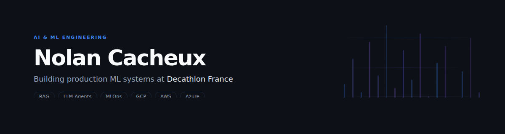

  

 

  <a href="https://www.linkedin.com/in/nolancacheux">LinkedIn</a> &nbsp;·&nbsp;
  <a href="mailto:cachnolan@gmail.com">cachnolan@gmail.com</a> &nbsp;·&nbsp;
  <a href="https://portfolio-nolan-cacheuxs-projects.vercel.app">Portfolio</a> &nbsp;·&nbsp;
  <a href="https://nolanfree.fr">Freestyle</a>

 

I build production-grade ML systems: RAG pipelines, LLM agents, forecasting models, and MLOps infrastructure on GCP, AWS, and Azure. Currently on the Effilab AI team at Decathlon France, pursuing my Master 2 in Data Science at JUNIA ISEN.

Junior World Champion in Freestyle Football (2019). 2x Vice-Champion of France. Top 15 World Ranking.

---

**Available for freelance AI/ML projects** — RAG systems · LLM agents · MLOps pipelines · Cloud deployment

---

### Featured Projects

| Project | Stack | What it does |
|:--------|:------|:-------------|
| [Rag-Equity-Research-Agent](https://github.com/nolancacheux/Rag-Equity-Research-Agent) | LangGraph, Qdrant, Azure | Autonomous equity research. Multi-source analysis (SEC 10-K, Yahoo Finance, Reddit), hybrid RAG. |
| [AI-Video-Comment-Analyzer](https://github.com/nolancacheux/AI-Video-Comment-Analyzer) | BERT, BERTopic, FastAPI | YouTube comment analysis with sentiment detection, topic clustering, LLM summaries. |
| [AI-Chess-Assistant](https://github.com/nolancacheux/AI-Chess-Assistant) | TypeScript, Stockfish, Vite | Chrome extension for chess.com. Real-time position analysis and move evaluation. |
| [AI-Product-Photo-Detector](https://github.com/nolancacheux/AI-Product-Photo-Detector) | EfficientNet, MLflow, FastAPI | MLOps pipeline for AI-generated image detection. Experiment tracking, drift monitoring. |
| [AI-Visualizer](https://github.com/nolancacheux/AI-Visualizer-Neural-Network-Architecture) | Three.js, React, Next.js | Interactive 3D neural network architecture explorer. |
| [distributed-data-platform](https://github.com/nolancacheux/distributed-data-platform) | Spark, Kubernetes, DuckDB | Multi-database distributed platform with ELT pipelines. |

---

### Technical Skills

**AI/ML** — Python, LangChain, LangGraph, TensorFlow, scikit-learn, Prophet, XGBoost, Transformers, MLflow

**Cloud & Data** — GCP (Vertex AI, Cloud Run), AWS (S3, SageMaker, Bedrock), Azure, Databricks, PySpark, Airflow, Terraform, Docker

**Backend** — FastAPI, Node.js, Express, NestJS, PostgreSQL, MongoDB, Redis

**Frontend** — React, Next.js, TypeScript, Three.js

---

  <picture>
    <source media="(prefers-color-scheme: dark)" srcset="https://raw.githubusercontent.com/nolancacheux/nolancacheux/output/github-contribution-grid-snake-dark.svg">
    <source media="(prefers-color-scheme: light)" srcset="https://raw.githubusercontent.com/nolancacheux/nolancacheux/output/github-contribution-grid-snake.svg">
    
  </picture>

